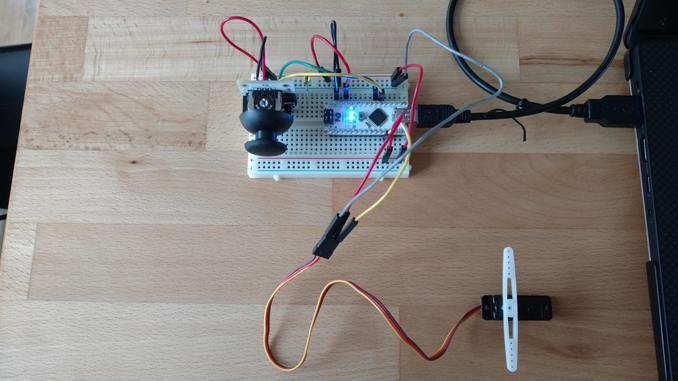
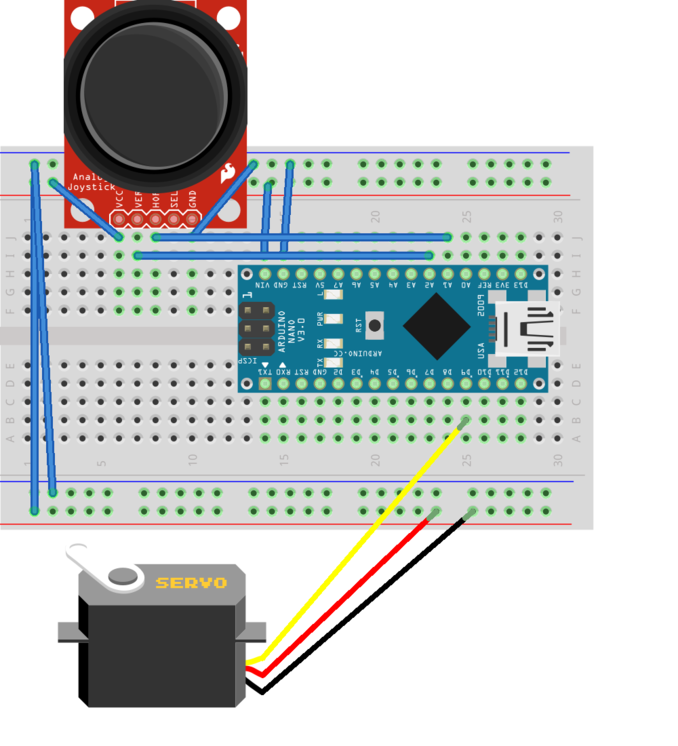

# Control a Servo with an ATmega328P MCU.

## Install

_Install the [Arduino IDE](https://www.arduino.cc/en/main/software)_

From the command line,
> python -m venv env

> source env/bin/activate

> pip install -r requirements.txt

## Run
From the Arduino IDE, flash joystick_and_serial_read.ino to the arduino

From the command line, within the project's root directory,
>python main.py

