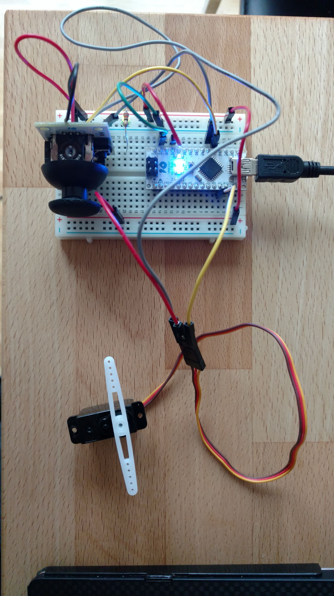

# Control a Servo with an ATmega328P MCU.

## Install
Arduino IDE

> python -m venv env

> source env/bin/activate

> pip install -r requirements.txt

## Run
flash joystick_and_serial_read.ino to the board

>python main.py

